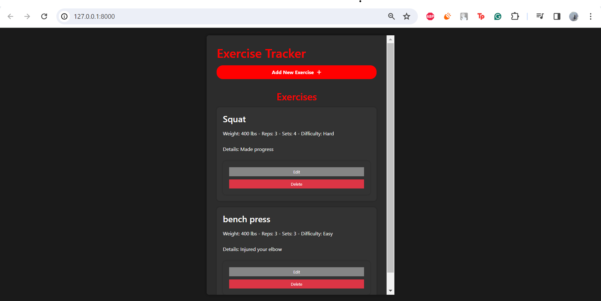

# Exercise Tracker App

This app is designed to track users' exercises across different workouts and lifts.
The app has the functionality of adding an "exercise", where the user is asked to input an exercise name,
weight, number of reps, number of sets, difficulty, and details. This information is stored and displayed, and can be edited and deleted.

Moving forward, the application will implement the following improvements:
- Ability to track progress over time using charts
- Improved User Interface
- Block user from adding same exercise twice

# Development

The backend for this project was developed using python. The file exercise utilizes FastAPI and JSON in order to call the logic for the add, edit, and delete functions. The model.py file serves to define the classes for the exercise parameters using pydantic.

The frontend for this project was developed using Bootstrap HTML, javascript, and CSS.

# Files

- [main.py code](mainpy_code.txt):
- [exercise.py code](exercisepy_code.txt):
- [model.py code](modelpy_code.txt):
- [index.html code](indexhtmlcode.txt):
- [main.js code](mainjs_code.txt):
- [styles.css code](stylescss_code.txt):

